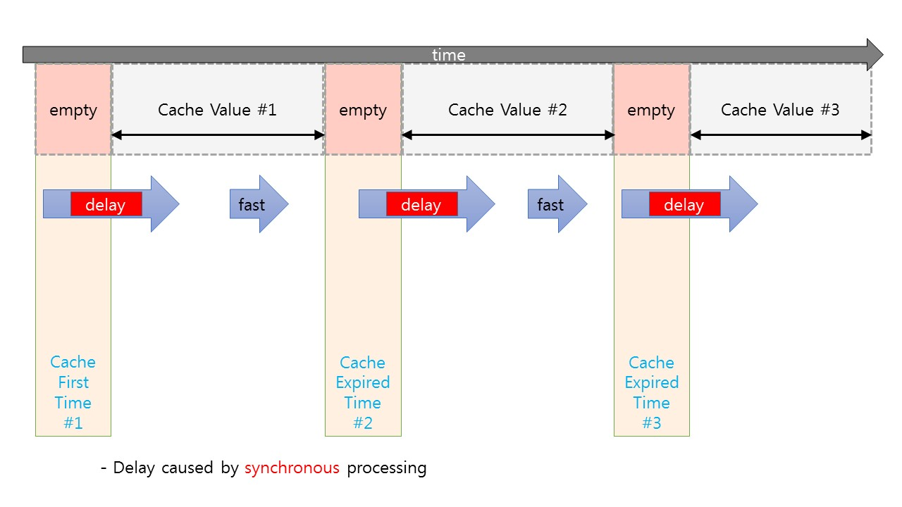
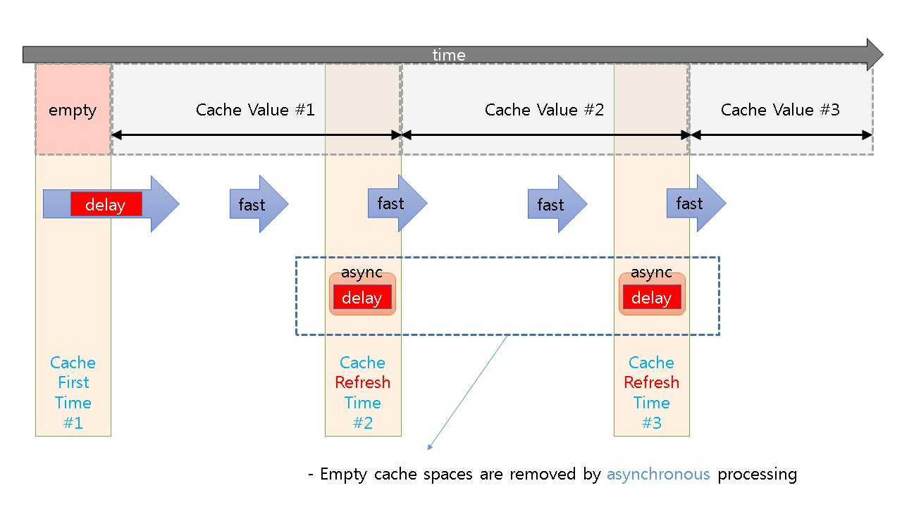
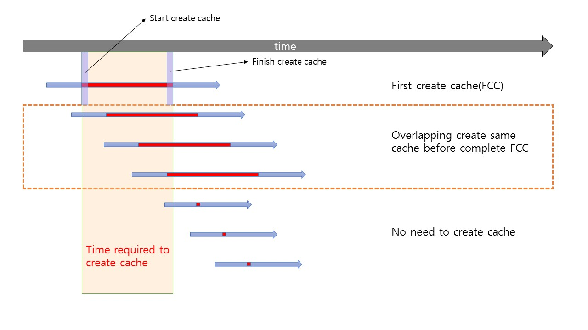
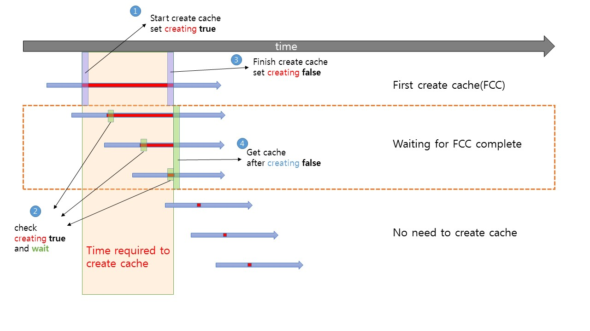
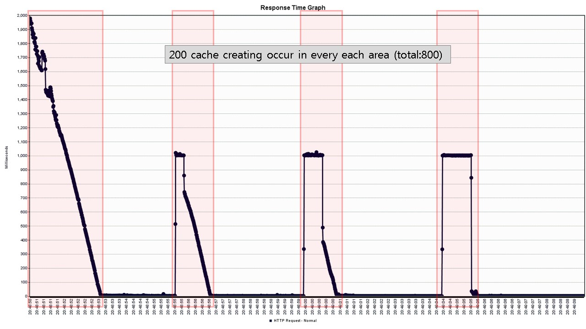
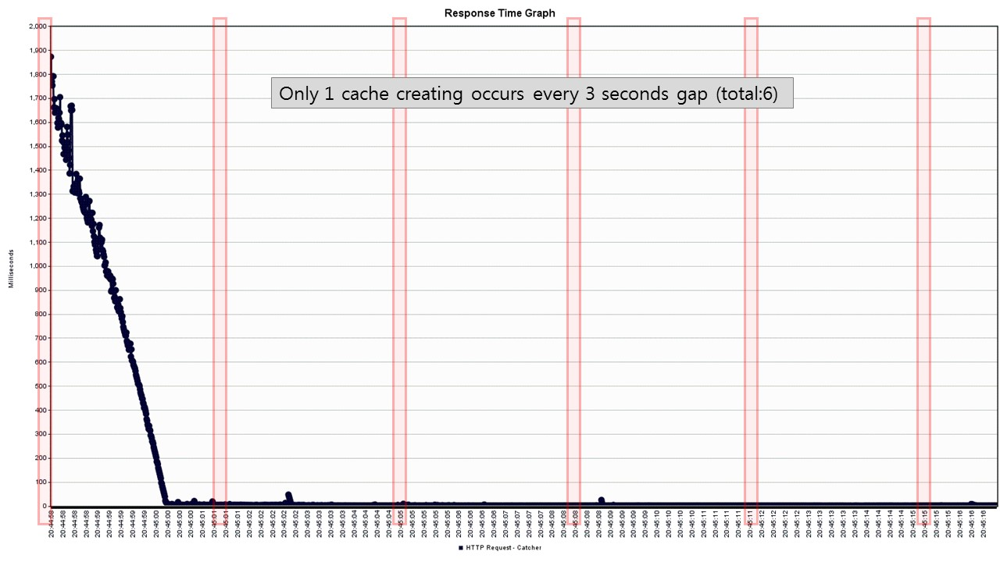

# java-catcher

Catcher is Java Cache Manager (multi request, async refresh, ..)

 
  

 

 

***

 
 

***

 
 

#### **jmeter web response test**  
threads : 10000  
periods : 10 seconds  
elapsed time : 16-18 seconds  
ehcache cache setting :  
  - version = 2.10.6
  - timeToLiveSeconds = 3  
  - 1 sec delay (Thread.sleep)

catcher setting :  
 - refresh time = 3 seconds  
 - expire time = 5 seconds (also ehcache timeToLiveSeconds = 5)

RESULT  
 - ehcache only :  
      cache creating occurred : **800**  
      response delay occurred : every cache creating  
 - eacache + catcher  
      cache creating occurred : **6**  
      response delay occurred : only first cache creating 
      

***
      
